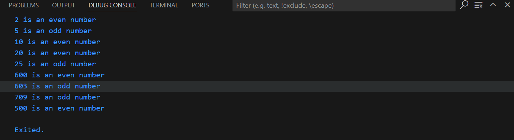

# Categorize a list of numbers into even or odd task
This piece of code is a simple example of how to determint if a number is even or odd using a switch case on a list of numbers.

## Steps:
1. Initialize The list of numbers.
2. Iterate through the list one by one.
3. For each number in the list check by % operator.
4. If it's even num % 2 will result in 0 so print It's an even number.
5. else num % 2 will result in 1 so print it's an odd number.

## Output:
