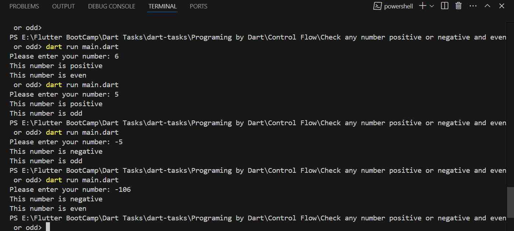

# Task General Description
Check any number positive or negative and even or odd using conditions and 
different operators

## How to run
dart run main.dart

## Steps:
1. read input from user.
2. parse it to integer before making any operations.
3. check if it's positive or negative.
4. after that check if it's even or odd.

## Output:
