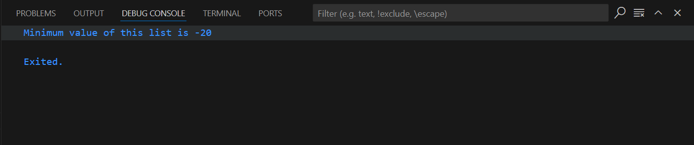

# Get the minimum value of a list of numbers
## Task General Description

Make a function that gets the minimum value of a list of numbers
## Steps:
1. Initialize list of numbers that will be sent to the function.
2. Iterate through the list in the function number by number.
3. initialize a min value and set it to first number in list.
4. check each number in the list and if it's less than or equal the current min val set it as the new min val.
5. Then return min val to main function and print it.

## Output:
