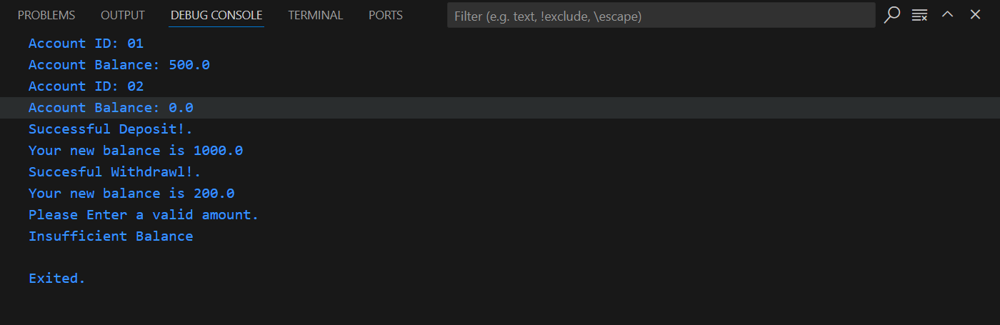

## Task General Description

Create a BankAccount class to withdraw or deposit amount of money
## Steps:
1. Create BankAccount class with two constructors first takes accountId and balance and the second takes accountId only and sets balance to 0.
2. Create displayAccountInfo method which is a simple method that only prints account id and it's balance.
3. Create depositCash method which takes amount to be deposited as a parameter and adds this amount to the current balance.
4. Create withdrawCash method which checks on three conditions:
	- if amount is positive and less than current balance then perform withdrawal.
	- if amount is more than current balance display insufficient balance message to the user.
	- if amount is negative then display to the user error and make him enter valid amount.
## Output:
