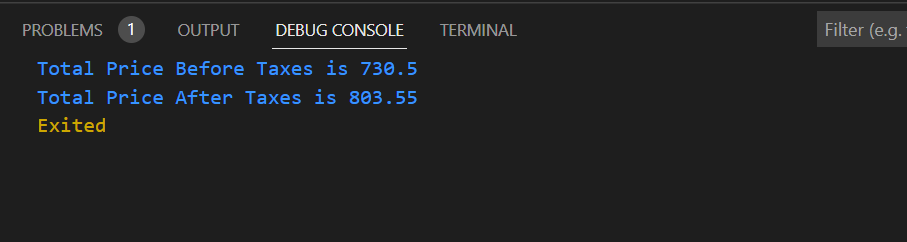

# Categorize a list of numbers into even or odd task
Calculate the total cost of grocery items using a list, map, variables, and constants.

## Steps:
1. Initialize a map containing grocery items and price of each item.
2. Iterate through the map item by item.
3. For each item add it's price to get total price.
4. Print total price before adding taxes.
5. Add 10% Tax to total and print it

## Output:
